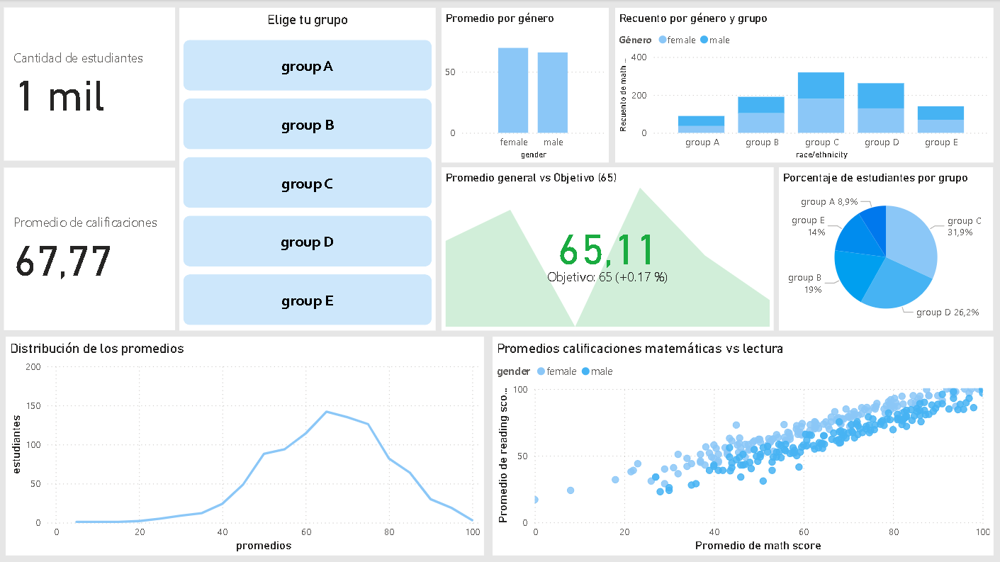
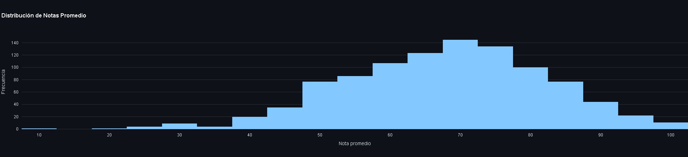
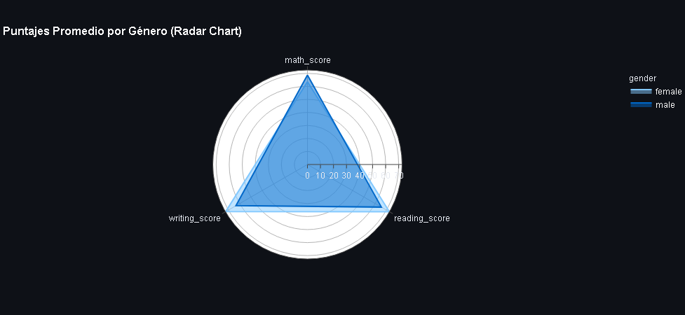
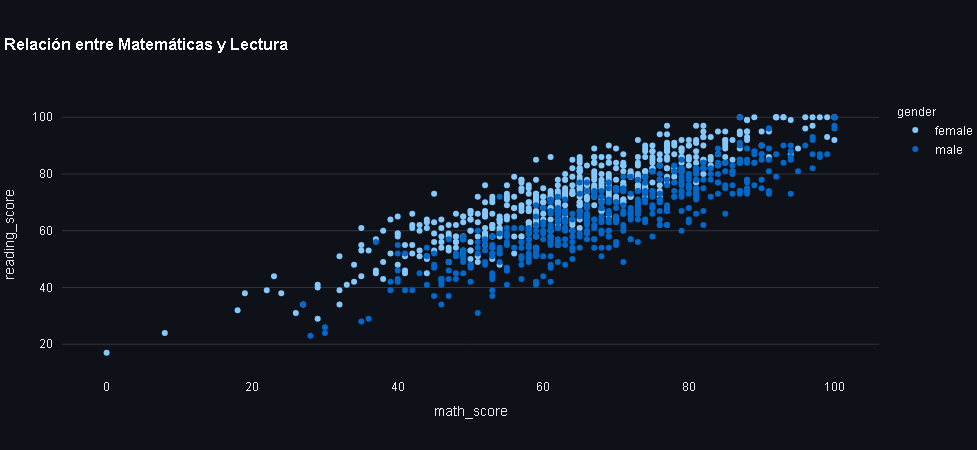
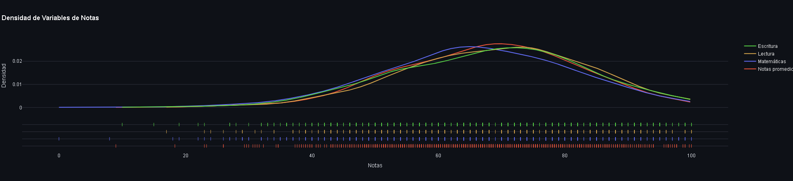

# 📊 Análisis de Rendimiento Académico con Streamlit

Este proyecto interactivo desarrollado con **Streamlit** permite analizar el rendimiento académico de estudiantes según variables demográficas y sociales. Se utilizan visualizaciones dinámicas y filtros para explorar patrones y comparaciones entre grupos. Se creó para entendimiento del dataset, como de las herramientas utilizadas.

## 🧠 Objetivo

Visualizar y entender cómo factores como el género, calificaciones y preparación previa influyen en los puntajes de Matemáticas, Lectura y Escritura.

---

## ⚙️ Tecnologías utilizadas

- **Python 3.10+**
- **Streamlit**
- **Plotly**
- **Pandas**
- **Plotly Figure Factory**
- **Seaborn (opcional)**

---

## 🗂️ Estructura de la App

Incluye:

- 🔥 Dashboard interactivo con Power Bi
- ✅ KPIs de promedio por materia
- 📊 Histograma y KDE (densidad) del puntaje promedio
- 📦 Boxplot de notas promedio por género
- 🎯 Dispersión entre Matemáticas y Lectura
- 🧭 Radar chart (línea polar) de puntajes promedio por género
- 🎛️ Filtros interactivos con `multiselect` para elegir variables a analizar

---

## 📁 Dataset

Se utiliza un dataset de estudiantes con las siguientes variables:

- `gender`
- `race/ethnicity`
- `parental level of education`
- `lunch`
- `test preparation course`
- `math_score`
- `reading_score`
- `writing_score`

El dataset debe contener además una columna `average_score` calculada como:

```python
df['average_score'] = (df['math_score'] + df['reading_score'] + df['writing_score']) / 3
```

---

## 🗂️ Vista previa del dashboard en Power Bi



## ▶️ Cómo correr la app

1. Cloná este repositorio:

```bash
git clone https://github.com/tuusuario/streamlit-analisis-educativo.git
cd streamlit-analisis-educativo
```

2. Instalá las dependencias:

```bash
pip install -r requirements.txt
```

3. Ejecutá la aplicación:

```bash
streamlit run app.py
```

---

## ✨ Ejemplos de Visualizaciones

| Histograma | Radar Chart |
|------------|-------------|
|  |  |

| Scatter Plot | Densidad (KDE) |
|------------|-------------|
|  |  |
---

## 🚀 Futuras mejoras

- Incorporación de técnicas de ML (clustering, regresiones)

---

## 🙌 Autor

Desarrollado por [Alejo](https://github.com/alejotrenti)


---
